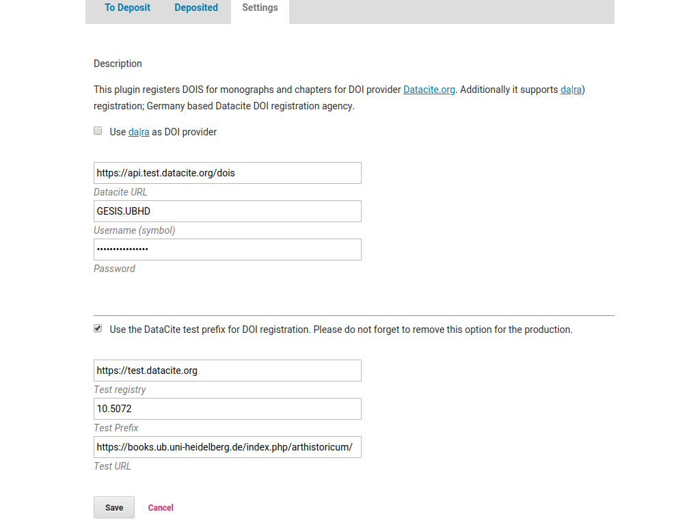
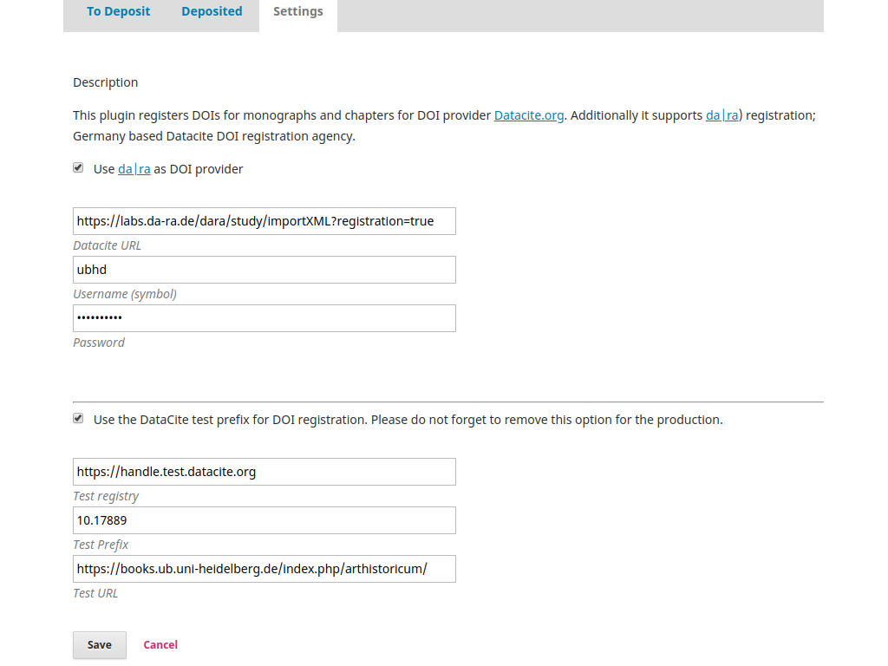
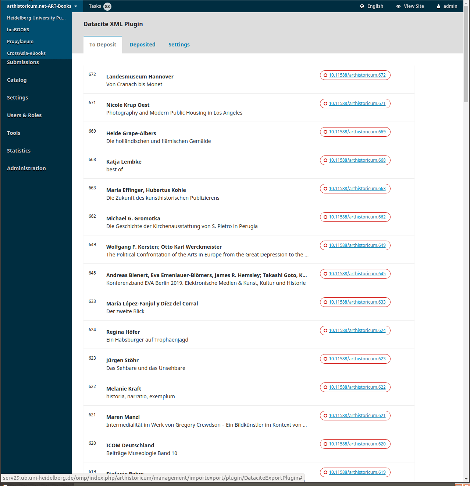

#### OMPDatacite and DA|RA Plugin

#### Introduction
This plugin registers DOIS for monographs and chapters  for DOI provider [Datacite.org](https://datacite.org).

Current Schema version is [4.3](https://support.datacite.org/docs/datacite-metadata-schema-43)

Additionally it supports [da|ra](https://www.da-ra.de/home/) registration;  Germany based Datacite DOI registration agency.


Translations available in : [German](README_DE.md)

####  Installation
```bash
OMP=/path/to/OMP_INSTALLATION
cd $OMP/plugins/importexport
git clone https://github.com/withanage/datacite
```

####  Setup Datacite

* Navigate to {OMP_SERVER}/index.php/{MY_PRESS}/management/importexport/plugin/DataciteExportPlugin
* Use da|ra as DOI provider: Leave unchecked
* Datacite URL : Use the test or production URL
* Username  : Username
* Password: Password
* Only for testing: Use the DataCite test prefix for DOI registration. Please do not forget to remove this option for the production.
* Test registry:  (Only for testing), provided by datacite
* Test URL:  (Only for testing) Production URL for overwriting the XML entries

####  Setup Da|ra


* Use da|ra as DOI provider: Please click this button
* Datacite URL : Use the test or production URL of DARA API
* Username  : Username
* Password: Password
* Only for testing: Use the da|ra test prefix for DOI registration. Please do not forget to remove this option for the production.
* Test registry:  (Only for testing), provided by da|ra
* Test URL:  (Only for testing) Production URL for overwriting the XML entries

#### Usage


####  Credits

Main Developer and Designer

[https://github.com/withanage](https://github.com/withanage)

Contributors

-  [Christian Marsilius](https://github.com/nongenti)

